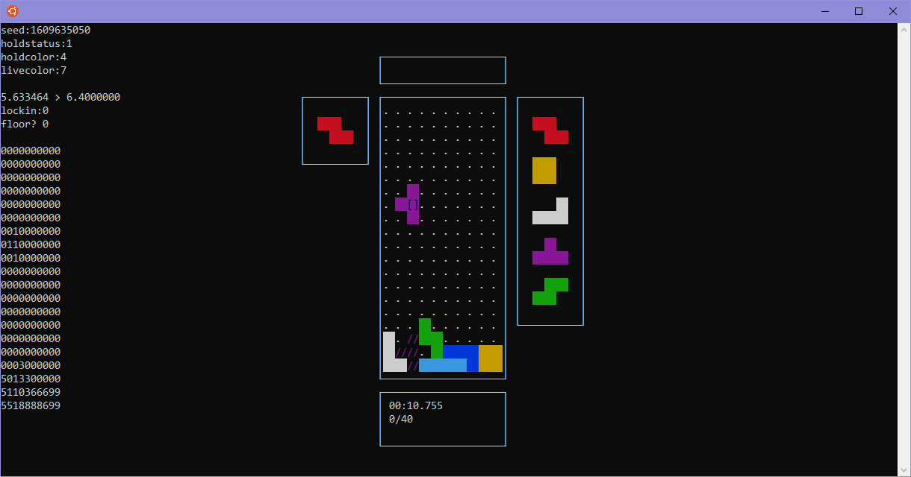

# Bytris

### About
Bytris is a modern tetris emulation written in C with the ncurses library.
Made to run in Unix shell environments.

---

### Run
Make sure to download all *.c and *.h files with run.sh and have them in the same directory.

You can then enter ```./run.sh```.
- If you cannot execute it, this make sure that run.sh is executable.
  - You can do this by typing ```chmod +x run.sh```
- If it doesn't compile, make sure that you have the ncurses library installed.

---
### Screenshot


<br/>

---

### Settings
If you need to change the controls you can go into ```cursemain.c``` and edit the constant variables under the section ```keyboard settings```

There you can also enable settings like the debug mode that I used for testing or adjusting the tickrate, lockdelay, and other settings.

#### By default the controls are:
| Action | Mapping |
| ----------- | ----------- |
| Move Left | Left Arrow |
| Move Right | Right Arrow |
| Rotate -90 | 'Z' |
| Rotate 90 | Up Arrow |
| Rotate 180 | 'X' |
| Soft Drop | Down Arrow |
| Hard Drop | Spacebar |
| Restart | 'A' |

---

### Features
#### Game:
- modified SRS rotation
	- two rotation types (offset, normal)
	- offset applies to the i and o block
	- tetromino.c contains rotation algorithm
- 21 row x 10 col board size
	- game displays bottom 20 rows
- 7 bag block generation
- fixed lock delay
- holding blocks
- sonic drop, left, and right

#### GUI:
- well display
- hold display
- next block display
- stats display
- game message display

#### Controls
- move left
- move right
- rotate clockwise
- rotate counterclockwise
- rotate 180
- soft drop
- hard drop
- sonic movement
	- sonic drop  : instant drop (no lock)
	- sonic left  : goes as far left as possible
	- sonic right : goes as far right as possible
- hold current piece

